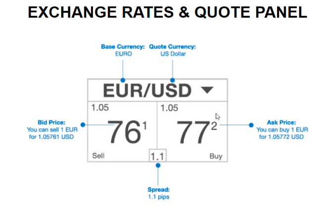

# Calculating the profit of a trade

The broker's profit is the spread, in this case 1.1 pips.

Pip: The unit of measurement to express the change in value between 2 currencies.
Typically the 4th decimal place of a price, for example:

EUR/USD changes from 1.0577 to 1.0578, the price of the EUR has increased by 1 pip.
In the above example, the quote actually has 5 decimal places, the 5th decimal is typically called a "pipette", 1/10th of a pip.

### An example trade
We buy 100,000 units of EUR/USD at $1.17775 and shortly after sell at $1.17791, what is our profit or loss?
Our OPENING trade value is: UNITS x PRICE_PER_UNIT
Our profit/loss (USD) is: TRADE_CLOSING_VALUE - TRADE_OPENING_VALUE
Our profit/loss (Pips) is how many pips the price has changed, in this case:

1.17791 - 1.17775 = 0.00016, 1 pip is the 4th decimal, so 1.6 pips.

Here's how it might look in a table.

|Time|Type|Instrument|Units|Price per unit (USD)|Trade Value (Units x Price)|Profit (USD)|Profit (Pips)|Pip Value (USD)|Balance|
|---|---|---|---|---|---|---|---|---|---|
|12:00|Buy|EUR/USD|100,000|$1.17775 ASK|$117,775.00| - | - | - | $100,000.00|
|12:02|Sell|EUR/USD|100,000|$1.17791 BID|$117,791.00|$16|1.6|$10|$100,016.00|

### Trading costs

Brokers need to make money as well, they do this via the spread, the difference between the BID/ASK prices.
If we were to BUY and then instantly SELL some instrument, we would lose the spread.
In order for any trades we make to reach a profit, they need to make more than the spread.

Note: Spread can change between opening and closing positions, if this happens, the trader will pay the AVERAGE of those spreads.
It is useful to calculate the "half-spread costs" of a trade to see what our typical trading costs are.
The "Mid Price" is used to calculate our "gross profit", which lets us calculate what our trading costs are.

(From above table)

|Price|Balance|Spread (Pips)|Half-Spread Costs (USD)|Mid Price (hypothetical)|
|---|---|---|---|---|
|1.17775|$100,000|1.6|-$8.00| (Price - (0.5 * Spread * 0.0001)) = 1.17767 |
|1.17791|$100,016|1.9|-$9.50| (Price + (0.5 * Spread * 0.0001)) = 1.17801 |

So now we can calculate our gross profit and trading costs.

Performance Attribution - The * 10,000 is just for converting from prices to pips.

| |Profit (USD)|Profit (Pips)|Return Percentage|
|---|---|---|---|
|Gross Profit|(Difference in mid prices * No of Units) = $33.50|(Difference in mid prices * 10,000) = 3.35| Profit_USD / Initial_Trade_Value = 33.5 / 117775 = 0.0284%|
|Trading Costs|Sum of half spreads = $17.50|Average of the two spreads = -1.75|Costs / Initial_Trade_Value = -0.0149%|
|Net Profit|$16.00|1.60|0.0136%|

Almost half our profit is taken by trading costs! So whatever strategy we use needs to be good enough to cover trading costs and then some!