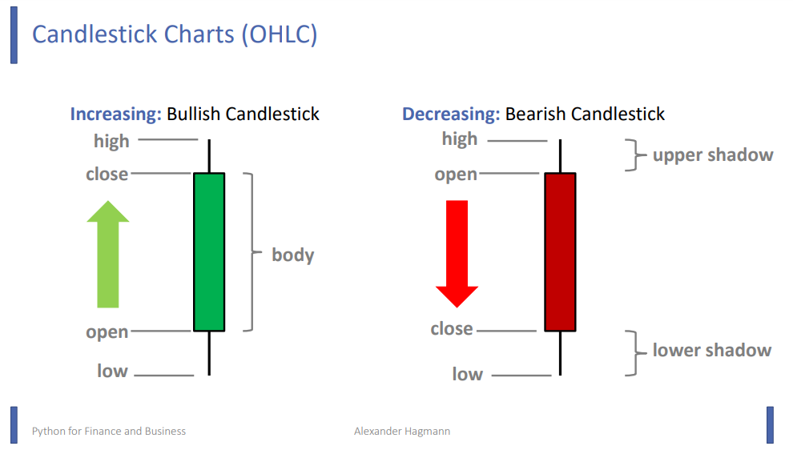
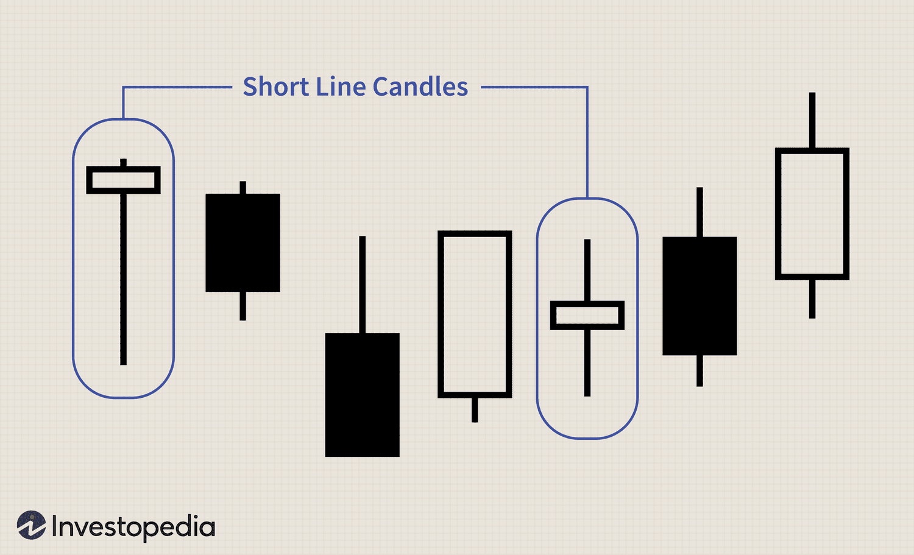

# Candlestick Charts

OHLC: Open High Low Close

Typically, green candles mean the price is going up, red candles mean the price is going down.
Each candlestick would represent some timeframe, be it 1 day, 4 hours, 5 minutes etc.

The little "wicks" or "shadows" of the candlesticks show the highest and lowest points the price has been within that timeframe,
large wicks indicating a lot of volatility. The body of the candle shows only the initial price and final price for that timeframe,
a price may fluctuate a lot during a timeframe but end at a similar price as pictured below.

Don't get sucked into analysing candlestick patterns and special names for each type of candlestick, technical analysis is useful
and does have a practical use, but trying to find stuff like "Gravestone Doji" and "Morning Star" is just Astrology for men.

We're using actual data and mathematical methods here, not pseudo-psychology.