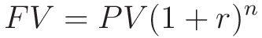
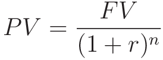
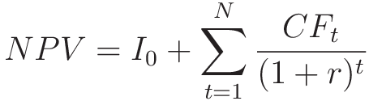

Terms and Formulae.
---
There are a fair number of domain specific terms to learn here, as well as several equations. This document serves as a reference sheet for the various acronyms and formulae covered in the course.

##### TVM - Time Value of Money
_"A dollar today is worth more than a dollar tomorrow."_

###### Compounding
- ***PV*** - Present Value
- ***FV*** - Future Value
- ***r*** - Interest Rate (per period)
- ***n*** - Number of periods

When we want to know how much something will be valued at after accruing interest for some amount of time, we use the above formula.

E.g. *"I have $100, and put it in an investment that pays 5% interest per years, I leave it for 5 years, what is the future value?"*

**FV = 100(1 + 0.05)^5 ≈ $127.63**

We can of course rearrange the formula to calculate what initial investment is needed to achieve a certain value.

E.g. *"I want my day trading account to have $1000 in it after 6 months, I believe I can make 3% profit per month, how much do I need to invest?"*

**PV = 1000 / (1.03)^6 ≈ $837.48**

##### Net Present Value
Used to determine if pursuing a project (E.g. buying a new machine) is worth it.
The cost of an initial investment plus all the benefits we expect to get from it would hopefully result in an overall profit.

- ***NPV*** - Net Present Value
- ***I0*** - Our initial investment, usually negative for buying something.(A machine costs $100, I0 = -100)
- ***N*** - Total number of time period (E.g. 5 years)
- ***CF*** - Cash Flow
- ***r*** - Interest rate

Let's say we buy a machine for $100 and expect it to increase our cash flows by:
1. $10 in year 1
2. $20 in year 2
3. $30 in year 3
4. $40 in year 4
5. $50 in year 5

We could do that, or put it in a savings account that pays 2% a year (that's our required rate of return)

The Net present value of buying the machine would be:

NPV = -100 + Sum( 10/(1.05), 20/(1.05^2), ... )

NPV = -100 + Sum(9.80, 19.22, 28.27, 36.95, 45.27)

NPV = -100 + 139.51

NPV = 39.51

Great, now we know the NPV of this project, how do we decide whether or not to do it? Simply:

Or in English: ***"Is this profitable?"***

